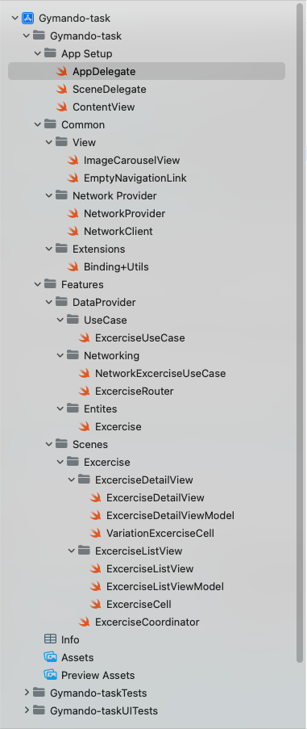

[![Swift Version][swift-image]][swift-url]

# Gymando - Task

## Features

- User Story #1: List of Exercises
- User Story #2: Exercise Detail
- User Story #3: Exercise Variations

## Compatibility

- iOS 14.0+
- Xcode 13.2.1

## Project overview

This is the submission of Coding challenge by Ahmed Shahid, provided by Gyamdo interviewer, please find the information related to the code below.

The project uses the `https://wger.de/de/software/api` to load a excercise list, show excercise details when users tap on a excercise. Inside the detail screen your can find the images of excercise if available, and variation of the same excercise. If you click on variation, you will redirect to varitaion screen.

The project uses MVVM-C (aka Model - View - ViewModel - Coordinator). Why is there Coordinator here? The Coordinator is an additional part for the MVVM, that help to separate navigation handling code to a different place, instead of putting it in the View (or View Controller in UIKit). It makes the view (or view controller in UIKit) more reusable, smaller. In my SwiftUI projects, Coordinator is a View, but only for handling navigation event purpose.

## What you can find in this project
- MVVM-C implement with SwiftUI and Combine framework.
- Networking with Combine framework, written in the way that help to test it. Separate layer of network provider for easy integration with other 3rd parties API.
- Usecase abstraction for each logical module
- Lazy Image Loading using [SDWebImage](https://github.com/SDWebImage/SDWebImage)
- Unit test: Mock network data, view model test, dependency injection, etc.
- Some useful extensions.
- Structure of a SwiftUI project.

## Project structure

## What you can be better from here
The thing I like most about programming is, there is always a room for improvement. My intension for this task is the show my knowledge about the latest and best practices of iOS. Following are the areas in which I feel that I didn't perform well

- Impresive UI: SwiftUI is still not a bread and butter for me, I intensionally spend very less time in making UI shiny.
- Error Handling: Error handling is not best in this project, if there is no data from API user will see only blank screen.
- Parallel API Calls: In `ExcerciseDetailViewModel.swift` I used `DispatchGroup` to call variation api in parallel which can be handle in Combine fashion.
- Exercise Variations: In Exercise Variations story, one of the acceptance critaria is missing, which due to lack of time I didn't debug.

[swift-image]:https://img.shields.io/badge/swift-5.0-orange.svg
[swift-url]: https://swift.org/
[travis-url]: https://travis-ci.org/dbader/node-datadog-metrics